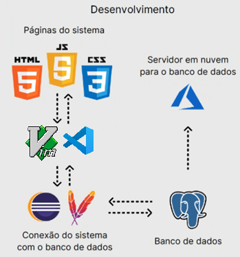
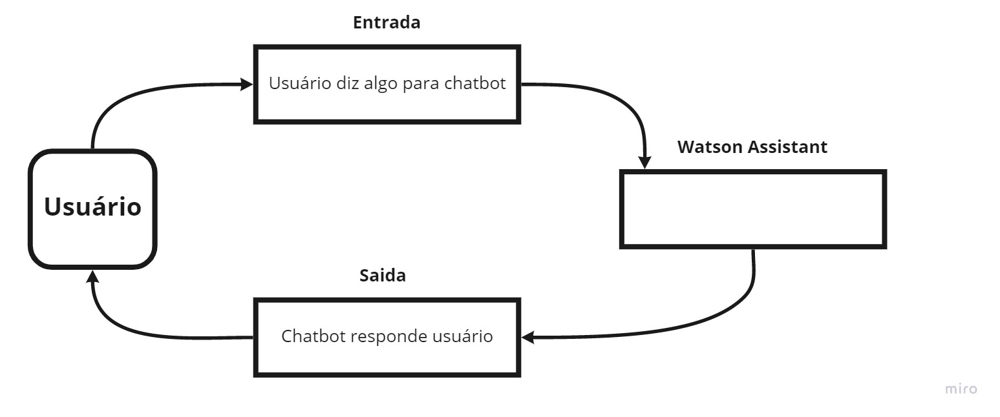
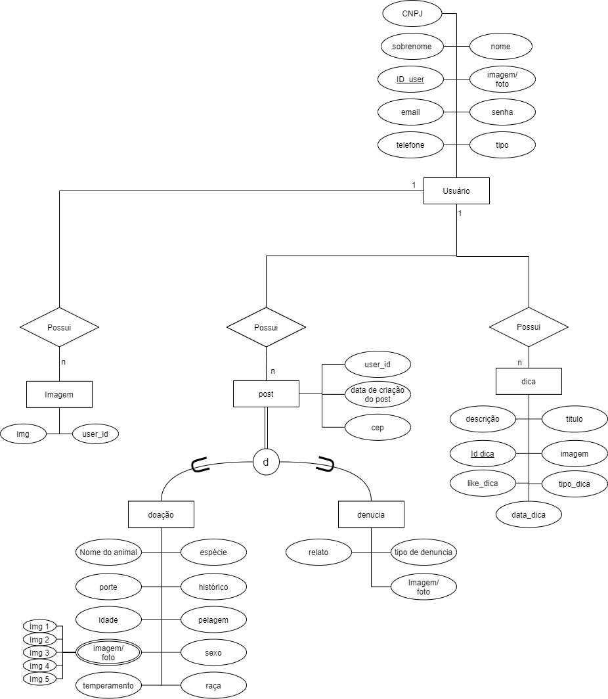
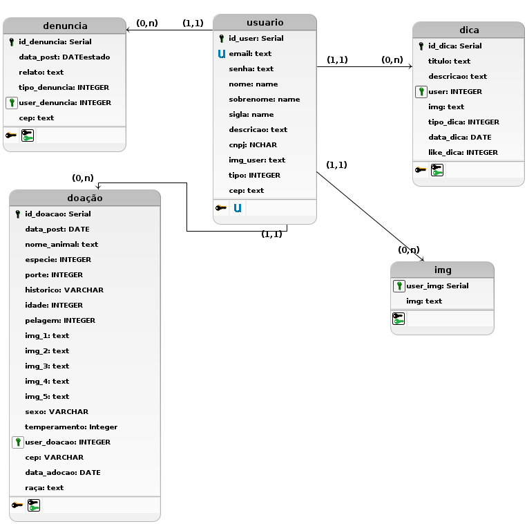
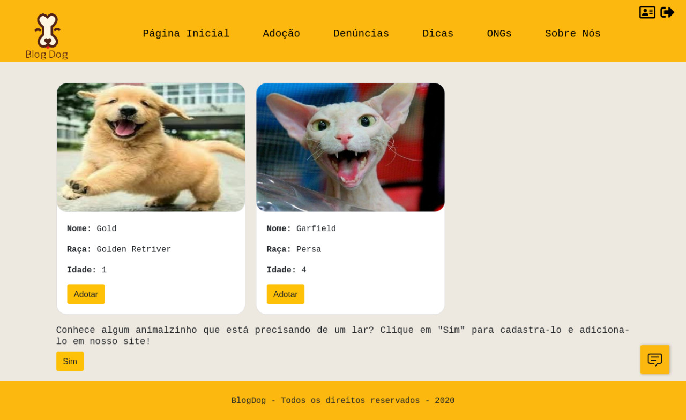
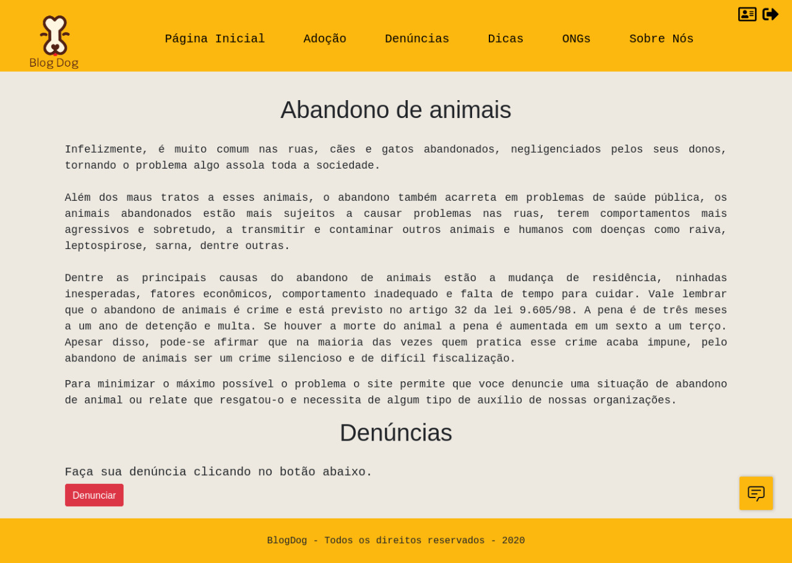
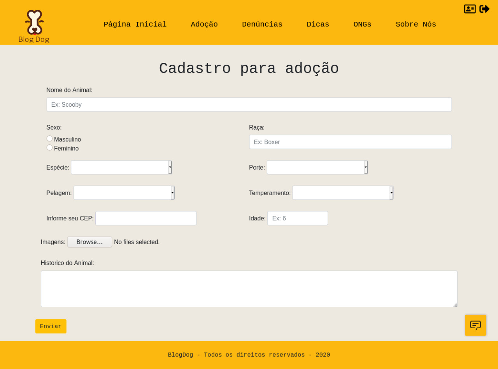
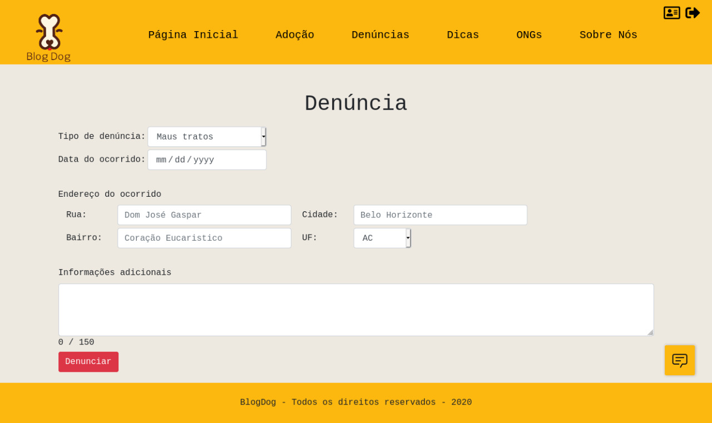

# TITULO DO PROJETO

**David de Sá Vieira de Faria, davidfaria38@gmail.com**

**Diego Da Silva Ferreira, diego_ferreira021@outlook.com**

**João Pedro Lobato de Pinho, joaoplp22@gmail.com**

**Walker Freitas dos Santos, walkerf082@gmail.com**

---

_Curso de Ciência da Computação, Unidade Coração Eucarístico_

_Instituto de Informática e Ciências Exatas – Pontifícia Universidade de Minas Gerais (PUC MINAS), Belo Horizonte – MG – Brasil_

---

_**Resumo**. Projeto Blogdog, ambiente virtual que vê combater os abusso contra os animais e encontrar lares para animais._

---

**1. Introdução**

 1.1 Contextualização
Blogdog foca em um problema recorrente no dia-a-dia das pessoas abandono de animais. algo muito comum nas ruas, cães e gatos abandonados, negligenciados pelos seus donos, tornando o problema algo assola toda a sociedade.

 1.2 Problema
Além dos maus tratos a esses animais, o abandono também acarreta em problemas de saúde pública, os animais abandonados estão mais sujeitos a causar problemas nas ruas, terem comportamentos mais agressivos e sobretudo, a transmitir e contaminar outros animais e humanos com doenças como raiva, leptospirose, sarna, dentre outras.

Dentre as principais causas do abandono de animais estão a mudança de residência, ninhadas inesperadas, fatores econômicos, comportamento inadequado e falta de tempo para cuidar.

vale a pena ressaltar que o abandono de animais é crime e está previsto no artigo 32 da lei 9.605/98. A pena é de três meses a um ano de detenção e multa. Se houver a morte do animal a pena é aumentada em um sexto a um terço. Apesar disso, pode-se afirmar que na maioria das vezes quem pratica esse crime acaba impune, pelo abandono de animais ser um crime silencioso e de difícil fiscalização.

 1.3 Objetivo geral
 
Propor um espaço virtual onde é possivel colaborar com ONGs e usuarios para cuidados de animais necessitados.

 1.3.1 Objetivos específicos    
O objetivo é elaborar um local onde permitirá registrar denúncias de animais abandonados, publicar anúncios relacionados a adoção de animais e responder os  mesmos, o site contará com contatos de abrigos de animais e sites de adoção de modo que o usuário do site poderá facilmente nos notificar caso encontre um animal abandonado, em situação de risco ou que presencie maus tratos. 

Além disso o site tem como responsabilidade conscientizar a população, através de artigos e dicas sobre como lidar com pets.

 1.4 Justificativas
Um site seria uma maneira mais fácil e prática de abranger várias pessoas com um objetivo em comum, o cuidado e o zelo por animais em situações inapropriadas e de risco. Com uma interface simples de ser usada e de fácil entendimento o site pode atender as necessidades de pessoas que não tem um contato corriqueiro com a internet.

O Brasil tem cerca de 30 milhões de animais abandonados e qualquer forma dentro da lei de amenizar esse problema é válida. 
Fonte:https://anda.jusbrasil.com.br/noticias/100681698/brasil-tem-30-milhoes-de-animais-abandonados
    

**2. Projeto da Solução**

2.1. Requisitos funcionais

| No.     | Descrição                                  | Prioridade |
| ------- |:------------------------------------------:| ----------:|
|    1    | Adotar de um animal                        | Alta       |
|    2    | Adicionar um animal para adoção            | Alta       |
|    3    | Denunciar abandono de animal               | Alta       |
|    4    | Denunciar agressão de animal               | Alta       |
|    5    | Compartilhar dicas/info no site            | Média      |
|    6    | Ingressar uma ONG como parceira do projeto | Média      | 
   
 
2.2. Tecnologias
A lista de tecnologias utilizadas no projeto Blogdog foram:

| Nome     | Tecnologias de desenvolvimento  |
| -------- |:--------------------------------:|
| GitHub                   | Repositorio                  |
| HTML 5, JavaScript, CSS  | Tecnologias de construção    |
| Eclipse, VS Code, Vim    | Editores de texto/IDE        |
| Maven                    | Sistema de gestão de projeto |
| PostgreSQL               | Banco de Dados               |
| Azure                    | Servidor                     |
| Watson assistant         | Chatbot                      |
  

    
 
2.3. Serviços inteligentes

    

**3. Modelagem de dados**
3.1. Diagrama de Entidade-Relacionamento

Diagrama de Entidade Relacionamento 

Diagrama do projeto logico

    
**4. Sistema desenvolvido**

1. Pagina incial  

- Fala um pouco sobre o projeto
- Pode navagar para todas outras paginas
    
 
2. Pagina adoção

- Pode ver posts de animais para adoção
- Pode navagar para todas outras paginas
    

3. Página denuncia Animais

- Pode ver informações sobre denuncias feitas por outros usuários
- Informa sobre os de denuncias
- Leva para pagina de castro de denuncia
- Pode navagar para todas outras paginas
    
 
4. Pagina cadastro adoção

- pode fazer cadastro de um animal para adoção
- Pode navagar para todas outras paginas
    
 
5. Pagina cadastro denuncia 

- pode fazer cadastro de um animal para adoção
- Pode navagar para todas outras paginas
    
 
6. Pagina ONGs 

- Pagina informando ONGs parceiras do site
- Contato para virar parceiro do site
- Pode navagar para todas outras paginas
    
 
7. Pagina creditos criadores 

- Pagina informando desenvolvedores da aplicação
- Pode navagar para todas outras paginas
    
 

    
**5. Avaliação**

Um ambiente virtual para combater o abandono e abuso de animais.
Nos acreditamos que fizemos um produto minimo viavel, em relação as interação com o usario, que se com mais tempo e dedicação poderiamos ter um site mais completo.

   
**6. Conclusão**

Graças ao projeto e as pesquisas relacionadas a ele foi concluído que existe um alto abandono de animais que persiste e se espalha por todo Brasil. Com o nosso projeto visamos suprir esse elevado índice que assola e mancha a imagem do nosso grande país 

Aplicando técnicas de sistemas inteligentes, banco de dados e algoritmos, ambos conteúdos oferecidos e abordados durante as aulas do curso de Ciência da Computação na PUC minas em parceria com a Microsoft Azure
    

**REFERÊNCIAS**

**[1.1]** - _ELMASRI, Ramez; NAVATHE, Sham. **Sistemas de banco de dados**. 7. ed. São Paulo: Pearson, c2019. E-book. ISBN 9788543025001._

**[1.2]** - _COPPIN, Ben. **Inteligência artificial**. Rio de Janeiro, RJ: LTC, c2010. E-book. ISBN 978-85-216-2936-8._

**[1.3]** - _CORMEN, Thomas H. et al. **Algoritmos: teoria e prática**. Rio de Janeiro, RJ: Elsevier, Campus, c2012. xvi, 926 p. ISBN 9788535236996._

**[1.4]** - _SUTHERLAND, Jeffrey Victor. **Scrum: a arte de fazer o dobro do trabalho na metade do tempo**. 2. ed. rev. São Paulo, SP: Leya, 2016. 236, [4] p. ISBN 9788544104514._

**[1.5]** - _RUSSELL, Stuart J.; NORVIG, Peter. **Inteligência artificial**. Rio de Janeiro: Elsevier, c2013. xxi, 988 p. ISBN 9788535237016._
